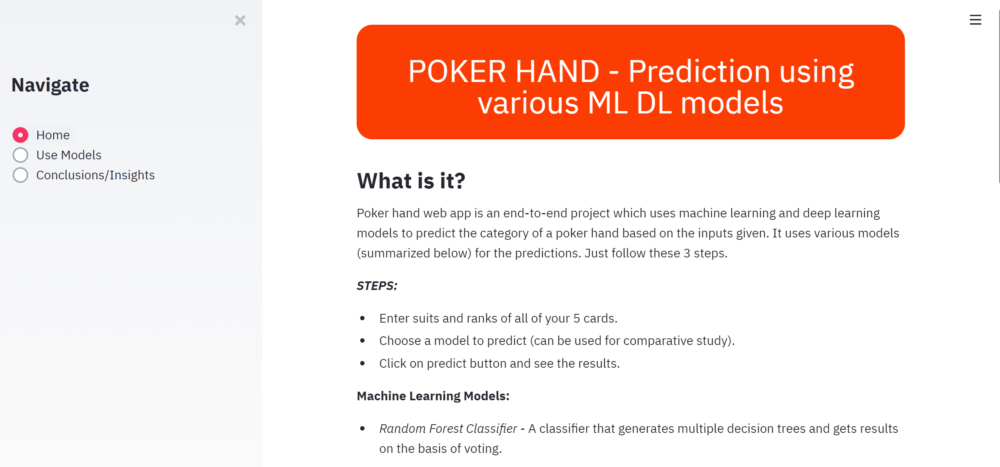
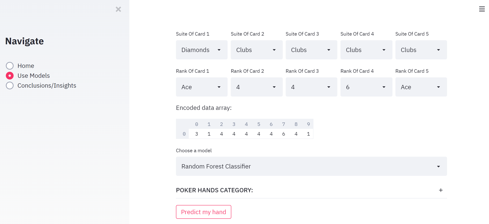
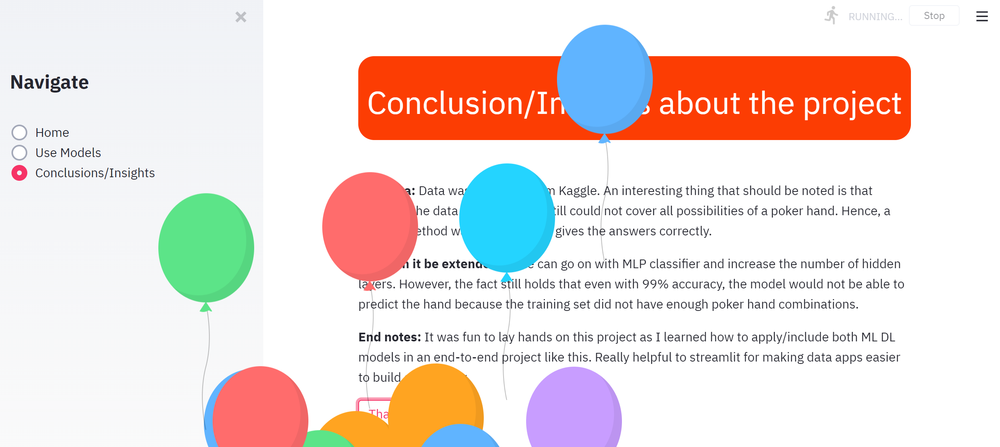

# Poker Hand

## Table of contents
1. [Description](#description)
2. [Screenshots](#screenshots)
3. [Steps taken in this Project](#project-steps)
4. [Installation and Usage](#installation-usage)

## Description 
Poker hand is a data web app designed for predicting what poker category a given set of cards belong to. It uses various machine learning and deep learning algorithms for prediction. Furthermore, to get 100% accuracy, a manually coded poker program was also provided for comparative study. The algorithms used are provided on the app's main page with their description and accuracies.

## Screenshots 

 

 

## Steps taken in this Project 
- Data collection
- EDA & visualization
- Model selection & building it
- Evaluation of the models
- Saving the models
- Application program for real time usage

## Installation and Usage  
- Requirements:
   - `python >= 3.6`
- `git clone https://github.com/AI-14/poker-hand.git` - clones the repository
- `cd poker-hand`
- `py -m venv yourVenvName` - creates a virtual environment
- `yourVenvName\Scripts\activate.bat` - activates the virtual environment
- `pip install -r requirements.txt` - installs all modules
- `streamlit run src\main.py` - runs the app
> Note: The model files .pkl and .h5 were removed due to their large size. Hence, to save them again from the jupyter notebook, run the algorithms in the notebook and then save them under **src\models***.

